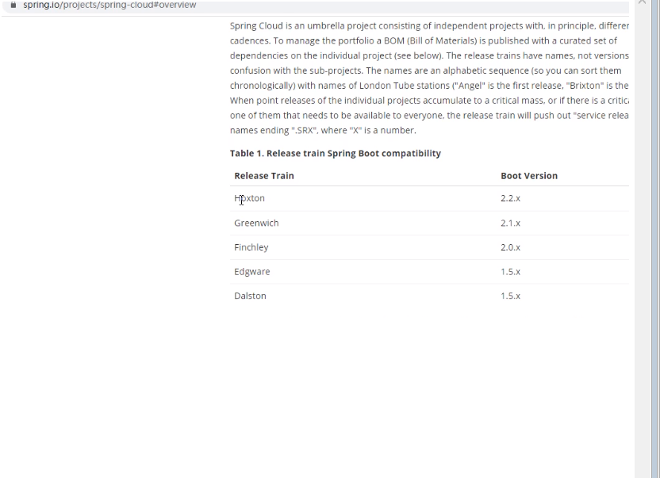

#springCloud
##Nginx
```text
Nginx是一款轻量级的Web 服务器/反向代理服务器及电子邮件（IMAP/POP3）代理服务器，在BSD-like 协议下发行。其特点是占有内存少，并发
能力强，事实上nginx的并发能力在同类型的网页服务器中表现较好，中国大陆使用nginx网站用户有：百度、京东、新浪、网易、腾讯、淘宝等。
```
###nginx三大配置
```text
一·反向代理
二·负载均衡
三·动静分离
```
```text
一·
    反向代理
        介绍反向代理前说明下正向代理
        正向代理：用户知道目标服务器地址，但由于网络限制等原因，无法直接访问。这时候需要先连接代理服务器，然后再由代理服务器访问
        目标服务器。
```

```text
        反向代理：反向代理对用户则是不可知的，比如我们访问百度网站，百度的代理服务器对外的域名为 https://www.baidu.com 。具体内
        部的服务器节点我们不知道，现实中我们通过访问百度的代理服务器后，代理服务器给我们转发请求到他们N多的服务器节点中的一个给我
        们进行搜索后将结果返回。
        此时在用户角度，代理服务器和访问的服务器是一体的。
```

```text
        在nginx配置反向代理
        实例一：反向代理一个tomcat服务器
        location / {
                    root   html;
                    proxy_pass  http://127.0.0.1:8080;
                    index  index.html index.htm;
                }
        实例二：反向代理两个tomcat服务器，根据访问路径不同进行区分服务器
        location ~ /aaa/ {
                    proxy_pass  http://127.0.0.1:8080;
                }
        location ~ /bbb/ {
                    proxy_pass http://127.0.0.1:8081;
               }
        其中 ~/aaa/是对路径进行正则表达式判断，若访问路径包含/aaa/则代理对应服务器
```
```text
二·
    负载均衡 
          负载均衡：分摊到多个操作单元上进行执行，和它的英文名称很匹配。就是我们需要一个调度者，保证所有后端服务器都将性能充分发
    挥，从而保持服务器集群的整体性能最优。即将请求根据负载均衡策略分配给不同的服务器上。
    在nginx上配置负载均衡
    upstream myServer{
            server 192.168.234.128:8080;
            server 192.168.234.128:8081;
       }
    server {
            listen       80;
            server_name  192.168.234.128;
    
            #charset koi8-r;
    
            #access_log  logs/host.access.log  main;
    
            location / {
                root   html;
                proxy_pass  http://myServer;
                index  index.html index.htm;
            }
        .......
    nginx提供的负载均衡策略
        1.权重：根据权重不同进行倾向性的分配请求。（在对应端口后配置其权重即可） 
            upstream [服务器组名称]{
            　　server [IP地址]:[端口号] weight=2;
            　　server [IP地址]:[端口号];
            　　....
            }
        2.ip_hash：基于客户端ip的分配方式，解决了session不可跨服务器问题。
            upstream [服务器组名称]{
            　　ip_hash;
            　　server [IP地址]:[端口号] weight=2;
            　　server [IP地址]:[端口号];
            　　....
            }
        3.轮询：平均的将请求分配，默认为轮询
        4.fair：根据服务器对请求的响应时间长短进行分配
            upstream [服务器组名称]{
            　　server [IP地址]:[端口号] weight=2;
            　　server [IP地址]:[端口号];
            　　....
            　　fair;
            }
```
```text
三·
    动静分离
        将动态和静态访问资源分开
        两种实现方式：
            一是动态资源交给tomcat，静态资源交给nginx，一般为这种
            二是动态静态一起，再由nginx对请求进行区分
        本文以第一中方法进行配置
        nginx配置动静分离
         location /www/{
                    root /data/;
                }
         location /image/{
                    root /data/;
                   #autoindex on是将文件所在母炉列出
                    autoindex on;
                }
```
##springcloud前期(技术选型)
```text
    springboot和springcloud的版本对应
```

```text
    目前springcloud已更新至最新H版
    springcloud官方json字符串中表示，H版对应的springboot版本为大于等于2.2.0小于2.2.5
```

```text
    在本次项目的选型中，选择springcloud版本为最新H版Hoxton SR1
    选择springboot版本为2.2.2版本，因为官方建议springcloudH版建议大配springboot2.2.2
```

```text
    由于微服务一些组件停止更新，导致2020年后，一些组件的技术变更
```

##支付模块
```text
    开发过程中遇到的细节问题
    POM文件：
        在父工程中POM文件的引入中使用<dependencyManagement>声明版本等信息
        在子工程引入依赖时可不用写版本信息（若想另外定义版本，也可在子工程独立定义，否则默认使用父工程定义版本）
        父工程需要将打包方式改为POM（maven默认方式为jar）
       Mybatis：
           将结果封装成自定义的Map
   ```
```xml
        <resultMap id="BaseResultMap" type="com.yang.springcloud.entities.Payment">
            <id column="id" property="id" jdbcType="BIGINT"></id>
            <id column="serial" property="serial" jdbcType="VARCHAR"></id>
        </resultMap>
        <select id="getPaymentById" parameterType="Long" resultMap="BaseResultMap"></select>
```
```text
        各个属性：
            type：对应的POJO Java类
            column：数据库对应属性
            property：Java类对应属性
            jdbcType：数据库对应属性的类型
    Lombok：
        @Slf4j：此注解使用后，使用日志时不在需要写Logger log=LoggerFactory.getLogger
        @AllArgsConstructor：使用此注解后，给类创建一个全参构造器
        @NoArgsConstructor：使用此注解后，给类创建一个空参构造器
    自动注入：
        在spring中提供@Autowired与@Qualifier注解自动注入
        java api提供@Resource注解进行自动注入
        区别：
            @Autowired是自动按类进行注入
            @Resource是自动按照名字进行注入
            （就像@Autowired可以搭配@Qualifier进行按照bean名注入，@Resource也可在属性type中定义实现按照类注入)
    springMvc：
        @RequestBody：接收json字符串，请求体中数据，用于post中（注意，格式为application/json,前端传参默认格式为application/x-www-form-urlencoded）
        注意，若以默认格式进行最终还是转换成key1=value1&key2=value2的格式
        @RequestParm：接收请求头中数据，即格式为xxx?username=123&password=456（由于get请求方式中没有请求体，故而该注解经常用于get请求方式）
    热部署：
        引入spring-boot-devtools依赖
        在父工程POM中引入插件
`````

```text
        调整IDEA,并重启
```

```text
        按住ctrl + shift +alt + / 选择Registry
```

```text
    REST访问
        在需求中，需要从客户端访问不同的微服务模块，在支付模块的访问中，使用RestTemplate进行访问
        将RestTemplate放入Bean中，使用RestTemplate的不同方法实现不同访问方式（如：postForObject进行POST访问）
```
##Eureka
````text
注：由于Eureka已经停更，所以本文主要阐述基础使用来阐述理念
服务治理：用来管理复杂的微服务之间的依赖关系，实现调用服务，负载均衡，容错等，实现服务注册以及发现
Eureka两大组件
    Server：提供服务的注册，将各个服务注册进Eureka中
    Client：通过注册中心进行注册，定时向注册中心发送心跳连接，注册中心一定时间没接收心跳会判定失效移除（但在eureka自我保护机制下不会移除）
在Eureka2.0后，Eureka将两个组件的依赖分开，在对应组件模块中引入对应依赖
Eureka单机使用
    Server：主启动类使用@EnableEurekaServer，为注册中心模块
    Client：主启动类使用@EnableEurekaClient，为微服务模块（包括用户访问模块）
Eureka集群使用
    在实际工作环境中，为防止一台注册中心宕机，需要进行集群配置
Eureka的集群配置
    理念：让多个eurekaServer相互注册，互相守望
          令Client在每个Server上注册
    实现：
        Server端：7002端口
````
```properties
        eureka.instance.hostname=eureka7002.com
        eureka.client.register-with-eureka=false
        eureka.client.fetch-registry=false
        eureka.client.service-url.defaultZone=http://eureka7001.com:7001/eureka/
```
```text
        Client端：8001端口
```
```properties
        eureka.client.fetch-registry=true
        eureka.client.register-with-eureka=true
        #eureka.client.service-url.defaultZone=http://localhost:7001/eureka  单机版
        #集群版
        eureka.client.service-url.defaultZone=http://eureka7001.com:7001/eureka,http://eureka7002.com:7002/eureka
```
```text
    eureka的负载均衡
        在将RestTemplate注入Bean中时，使用@LoadBalance赋予其负载均衡能力（默认方式为轮询）
    设置eurekaServer显示的信息
        将服务主机名称修改
```
```properties
        eureka.instance.instance-id=payment-8001
```
```text
        访问信息显示ip（鼠标放在服务名称上左下角显示ip）
```
```properties
        eureka.instance.prefer-ip-address=true
```
```text
    服务信息的发现
        用来发现注册在Server上服务的信息
        实现：
            注入DiscoveryClient来进行发现具体的服务信息
            主启动类使用@EnableDiscoveryClient（这个注解之后也会使用）
    eureka的自我保护机制
        eureka为了CAP中AP部分（高可用与分区容错），设计了自我保护机制
        具体内容：在一些情况下（网络卡顿等），会导致Client向Server发送的心跳没有接收，在自我保护机制下，就不会直接将这个服务判定为无效服务并删除
        会继续保存在注册中心
         

        取消自我保护机制（若特殊情况下的需求）
        在Server端：
```
```properties
            eureka.server.enable-self-preservation=false 
```
##Zookeeper
```text
    zookeeper有独自的服务器，但是没有网页可视化界面
```
 POM文件
```xml
  <dependency>
            <groupId>org.springframework.cloud</groupId>
            <artifactId>spring-cloud-starter-zookeeper-discovery</artifactId>
  </dependency>
```
```text
  注意：在这里的启动器中的zookeeper可能会和所装的zookeeper版本相冲突，所以需要屏蔽掉启动器带的zookeeper，再次引入相关依赖
```
配置文件
```properties
    spring.cloud.zookeeper.connect-string=192.168.234.128:2181
```
```text
    @EnableDiscoveryClient：用于在consul和zookeeper的注册中心注册服务
                            同时若想要使用DiscoveryClient需要引入
```
Linux命令
```text
    在zookeeper的bin目录下
    ./zkServer.sh start
    ./zkClient.sh

    ./zkServer.sh stop
```
```text
    zookeeper属于对于服务遵循CP，对于没有在规定时间内进行心跳连接的服务直接删除
```
##consul
```text
    consul拥有独立的服务器，且具备网页可视化界面
```
POM文件
```xml
<!--SpringCloud consul-server-->
        <dependency>
            <groupId>org.springframework.cloud</groupId>
            <artifactId>spring-cloud-starter-consul-discovery</artifactId>
        </dependency>
```
配置文件
```properties
    spring.cloud.consul.host=192.168.234.128
    spring.cloud.consul.port=8500
    spring.cloud.consul.discovery.service-name=${spring.application.name}
```
```text
    同样需要使用@EnableDiscoveryClient
```
~~Linux命令~~
```text
    配置集群：
        consul agent -server -bootstrap -ui -data-dir=/var/lib/consul-data -bind=172.16.8.251 -client=0.0.0.0 -node=172.16.8.251
        consul agent -server -join=172.16.8.251 -ui -data-dir=/var/lib/consul-data -bind=172.16.8.252 -client=0.0.0.0 -node=172.16.8.252
        consul agent -server -join=172.16.8.251 -ui -data-dir=/var/lib/consul-data -bind=172.16.8.253 -client=0.0.0.0 -node=172.16.8.253
     server： 以server身份启动。默认是client
     bootstrap-expect：集群要求的最少server数量，当低于这个数量，集群即失效。
     data-dir：data存放的目录，更多信息请参阅consul数据同步机制
     node：节点id，集群中的每个node必须有一个唯一的名称。默认情况下，Consul使用机器的hostname
     bind：监听的ip地址。默认绑定0.0.0.0，可以不指定。表示Consul监听的地址,而且它必须能够被集群中的其他节点访问。Consul默认会监听第一个private IP,但最好还是提供一个。生产设备上的服务器通常有好几个网卡，所以指定一个不会出错
     client: 客户端的ip地址，0.0.0.0是指谁都可以访问（不加这个，下面的ui :8500无法访问）
     ui: 可以访问UI界面
    -config-dir指定配置文件夹，Consul会加载其中的所有文件
    -datacenter 指定数据中心名称，默认是dc1
```
##Ribbon
```text
    ribbon是提供客户端负载均衡和服务调用
    负载均衡
        集中式LB：将请求按照某种策略分配给服务，如nginx
        进程式LB：将LB给消费方，消费者从注册中心选择服务进行访问，如ribbon
    简单来说，ribbon=负载均衡+restTemplate
    eureka中集成了ribbon，所以引入eureka后并不需要单独引入ribbon
    restTemplate的使用
        restTemplate.xxxForObject：返回对象为响应体数据转化的对象，基本上可理解为json
        restTemplate.xxxForEntity：返回对象为ResponseEntity，包含响应的一些重要信息
    ribbon负载均衡算法：
        总接口为IRule，实现的有：
            RoundRobinRule：轮询（默认）
            RandomRule：随机
            RetryRule：重试
            ....
    替换负载均衡方法：
        在@Compontent扫描的包外创建一个配置类，将对应想更换的负载均衡方式加入bean中
        （官方警告，为了达到私人定制的效果，需要这样做，否则会被所有ribbon客户端共享）
        在对应想更换的消费方的启动类进行如下配置
```
```java
        /**name为进行负载均衡的服务端在注册中心的名称，configuration为你定义的配置类
        @RibbonClient(name = "CLOUD-PAYMENT-SERVICE",configuration = MySelfRule.class)
```
```text
    ribbon轮询算法原理：
        每次访问将next值加一，下标为next%服务实例集合的大小，再根据下标在集合中取出对应服务的实例
    手写轮询算法
```
```java
    
    @Component
    public class MyLb implements LoadBalance {
        private AtomicInteger atomicInteger=new AtomicInteger(0);
        public final int next(){
            int current;
            int next;
            //此处ribbon官方源码使用的for(;;)，此处使用do-while代替
            do {
                current=this.atomicInteger.get();
                next= current>=2147483647?0:current+1;
            //CAS算法
            }while(!atomicInteger.compareAndSet(current,next));
            System.out.printf("******第%d次访问*******\n",next);
            return next;
        }
        @Override
        public ServiceInstance server(List<ServiceInstance> serviceInstances) {
            int index=next()%serviceInstances.size();
            return serviceInstances.get(index);
        }
    }
```
##OpenFeign
```text
    OpenFeign是在接口处添加注解访问服务，符合了调用接口实现需求的步骤
    OpenFeign集成了Ribbon，能够实现负载均衡的要求
    使用步骤
```
```text
        POM引用
```
```xml
        <dependency>
             <groupId>org.springframework.cloud</groupId>
             <artifactId>spring-cloud-starter-openfeign</artifactId>
        </dependency>
```
```text
        properties配置（本文使用eureka服务注册，故而为eureka配置）
        启动类使用@EnableFeignClient
        对应应用接口(name为在注册中心的服务名，其中的@GetMappling为在服务中对应功能的controller路径)
```
```java
            @FeignClient(name = "CLOUD-PAYMENT-SERVICE")
            public interface PaymentFeignService {
                @GetMapping("/payment/lb")
                public String lb();
            }
```
```text
        超时控制：
            问题出现：由于有些服务本身需要时间去处理，在这是处理时间较长的服务会存在访问超时的问题
            问题解决：手动设置最长连接时间和读取时间
```
```properties
            #openFeign超时设置
            #ribbon.ReadTimeout=6000
            #ribbon.ConnectionTimeout=600
```
##HyStrix
```text
    扇出：多个微服务之间调用时候，假设微服务A调用微服务B和微服务C，微服务B和C有调用其他微服务，这叫做扇出
   问题出现：
        在扇出的链路上某个微服务的调用相应时间过长或者不可用，导致对微服务A的调用就会占用越来越多的系统资源，继而引起系统崩溃
    HyStrix是一种用于处理延迟和容错的一个“断路器”，对故障微服务进行服务降级，服务熔断，服务监控
```
###服务降级
```text
    类似过滤器，当出现特定情况下，触发回滚
    降级的情况
        1.程序异常
        2.超时
        3.服务熔断引发的服务降级
        4.线程池/信号量不足导致服务降级 
```
    Demo：
```xml
 <!--hystrix-->
        <dependency>
            <groupId>org.springframework.cloud</groupId>
            <artifactId>spring-cloud-starter-netflix-hystrix</artifactId>
        </dependency>
```
```java
/**
 *主启动类使用@EnableCircuitBreaker注解
 *本次例子使用超时
 *HystrixProperty中内容在com.netflix.hystrix.HystrixCommandProperties
**/
@GetMapping("/payment/timeOut")
    @HystrixCommand(fallbackMethod = "getInfo_time_outHandler",commandProperties = {
            @HystrixProperty(name = "execution.isolation.thread.timeoutInMilliseconds",value = "3500")})
    public String time_out() throws InterruptedException {
        return timeService.getInfo_TimeOut();
    }
```
```text
    但是上面的demo存在问题：
        1.需要一个业务方法对应一个回滚方法
        2.回滚方法和业务方法混在一起
    问题解决：
        1.使用@DefaultProperties(ignoreExceptions = NumberFormatException.class,defaultFallback = "getInfo_time_outHandler")
        2.Openfeign提供对HyStrix的整合
            Demo：
```
```xml
 <!--hystrix-->
        <dependency>
            <groupId>org.springframework.cloud</groupId>
            <artifactId>spring-cloud-starter-netflix-hystrix</artifactId>
        </dependency>
```
```java
    /**
     *主启动类使用@EnableHystrix，@EnableFeignClients注解（@EnableHystrix继承@EnableCircuitBreaker）
     *在service中@FeignClient(name = "CLOUD-GATEWAY",fallback = ""),fallback处写写的回滚方法所在的类
     *回滚方法所在的类实现HystrixService接口，并加入容器中
    **/
```
###服务熔断
```text
    服务熔断类似保险丝，作为断路器，存在三种状态：关闭，半开，打开
    在一定条件下，断路器打开，服务不会调用，进入服务降级，再过一段时间，断路器处于半开状态，若请求符合规则，则断路器关闭，服务正常访问，若不符合，进入回滚方法
    Demo：
```
```java
/**
*@Hystrix配置信息：
*      开启熔断
*      访问次数（在一定时间内）
*      设置一段时间
*      访问失败率
**/
     @GetMapping("/payment/cBreaker/{id}")
        @HystrixCommand(fallbackMethod = "error_Handler",commandProperties = {
                @HystrixProperty(name = "circuitBreaker.enabled",value = "true"),
                @HystrixProperty(name = "circuitBreaker.requestVolumeThreshold",value = "10"),
                @HystrixProperty(name = "circuitBreaker.sleepWindowInMilliseconds",value = "10000"),
                @HystrixProperty(name = "circuitBreaker.errorThresholdPercentage",value = "60")
        })
        public String cBreaker(@PathVariable("id")int id){
            if (id<0){
                throw new NumberFormatException();
            }
            String serial= IdUtil.simpleUUID();
            return serial+"O(∩_∩)O";
        }
```
###服务监听
```text
    在对应监控服务引入依赖，并在启动类使用@EnableHystrixDashboard
```
```xml
<!--hystrix dashboard-->
        <dependency>
            <groupId>org.springframework.cloud</groupId>
            <artifactId>spring-cloud-starter-netflix-hystrix-dashboard</artifactId>
        </dependency>
```
```text
    在每个被监控的服务引入actuator依赖
    在被监控的启动类下写以下内容（）
```
```java
  /**
     * 此配置是为了服务监控而配置，与服务容错本身无观，springCloud 升级之后的坑
     * ServletRegistrationBean因为springboot的默认路径不是/hystrix.stream
     * 只要在自己的项目中配置上下面的servlet即可
     * @return
     */
    @Bean
    public ServletRegistrationBean getServlet(){
        HystrixMetricsStreamServlet streamServlet = new HystrixMetricsStreamServlet();
        ServletRegistrationBean<HystrixMetricsStreamServlet> registrationBean = new ServletRegistrationBean<>(streamServlet);
        registrationBean.setLoadOnStartup(1);
        registrationBean.addUrlMappings("/hystrix.stream");
        registrationBean.setName("HystrixMetricsStreamServlet");
        return registrationBean;
    }
}
```
##GateWay网关
```text
    网关相当于在为服务外套了一层的“关卡”，可以实现一些过滤功能：熔断，限流，重试。。。。
    网关存在Zuul Zuul2 GateWay，但是由于前两个处于停更状态，而且GateWay基于Spring Frame5，Project Reactor和SpringBoot 2.0
    故而我们选择使用GateWay

    GateWay三大特性：路由，断言，过滤
    Demo：
```
```yaml
     cloud:
        gateway:
          discovery:
            locator:
              enabled: true
          routes:
            - id: payment-get
              uri: lb://CLOUD-PAYMENT-SERVICE
              predicates:
                - Path=/payment/get/**
            - id: payment-lb
              uri: lb://CLOUD-PAYMENT-SERVICE
              predicates:
                - Path=/payment/lb/**
                - After=2020-10-10T13:30:43.757+08:00[Asia/Shanghai]
```
```text
    实现负载均衡：引入eureka依赖，在路由uri中写lb://CLOUD-PAYMENT-SERVICE（在eureka注册中心中的服务名）
    断言设置：
        常用断言：
```


```text
    过滤实现：
        1.使用官方提供过滤：
```

```text
        2.自定义过滤
```
```java
@Slf4j
@Component
public class GateFilter implements GlobalFilter, Ordered {

    @Override
    public Mono<Void> filter(ServerWebExchange exchange, GatewayFilterChain chain) {
        log.info("Date:"+new Date());
        ServerHttpRequest request=  exchange.getRequest();
        String username=request.getQueryParams().getFirst("user");
        if (username.equals("")||username.length()==0){
            exchange.getResponse().setStatusCode(HttpStatus.NOT_ACCEPTABLE);
            return exchange.getResponse().setComplete();
        }
        return chain.filter(exchange);
    }

    @Override
    public int getOrder() {
        return 0;
    }
}
```